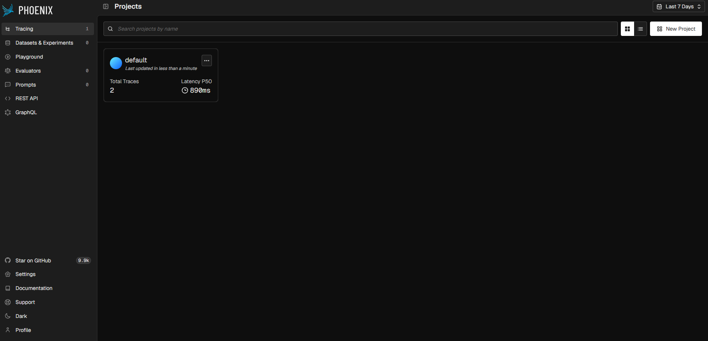
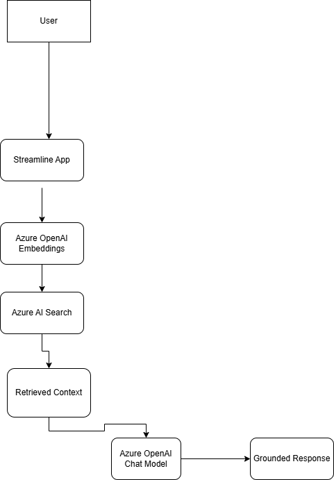

## Observability

This project integrates Phoenix observability for:

- LLM tracing
- Prompt inspection
- Retrieval monitoring
- Latency analysis
- Semantic reranking evaluation

Phoenix provides visibility into:

- OpenAI embedding requests
- Chat completion calls
- Retrieval performance
- End-to-end latency
- RAG execution traces
- Prompt and response inspection

### Phoenix Dashboard

## Architecture Diagram

## Semantic Reranking

The application retrieves the top candidate chunks from Azure AI Search.

An Azure OpenAI model reranks the retrieved chunks and selects the most relevant context before generating the final answer.

Benefits:

- Improved answer quality
- Better context relevance
- Reduced hallucinations
- More accurate retrieval